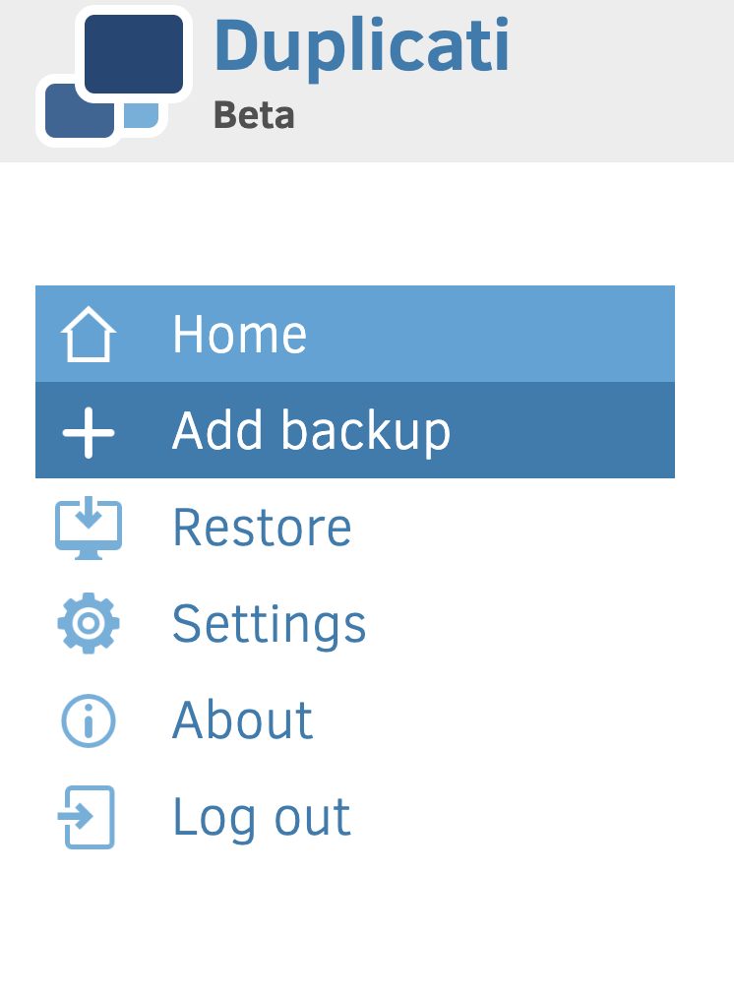
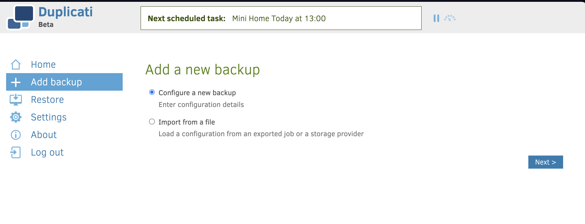
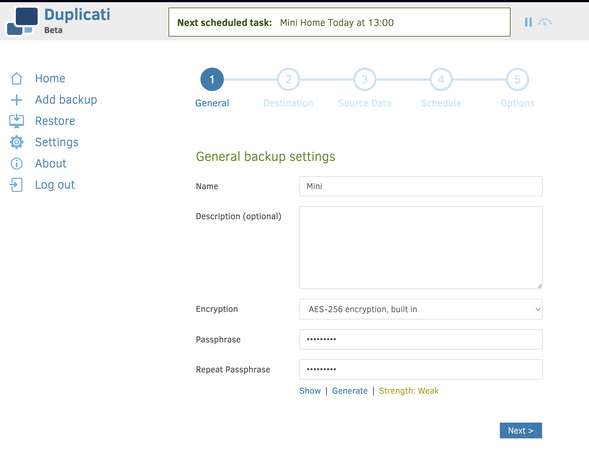
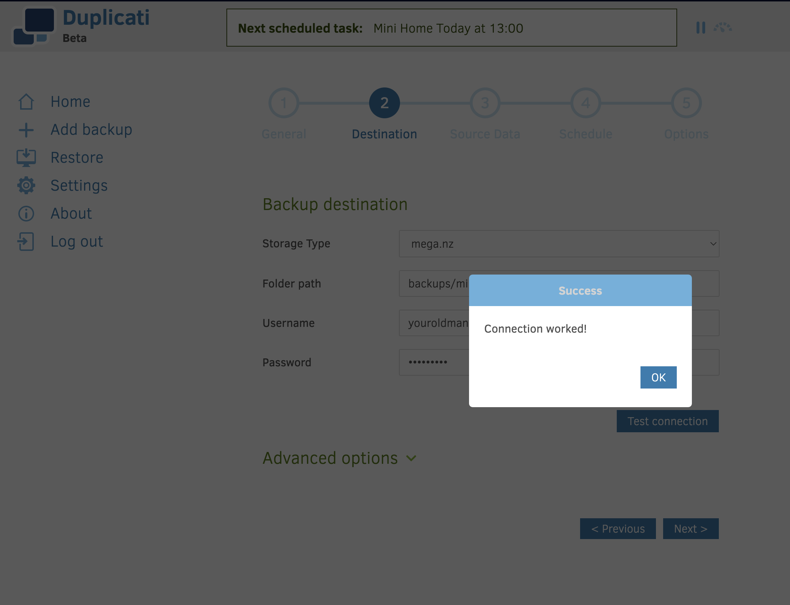
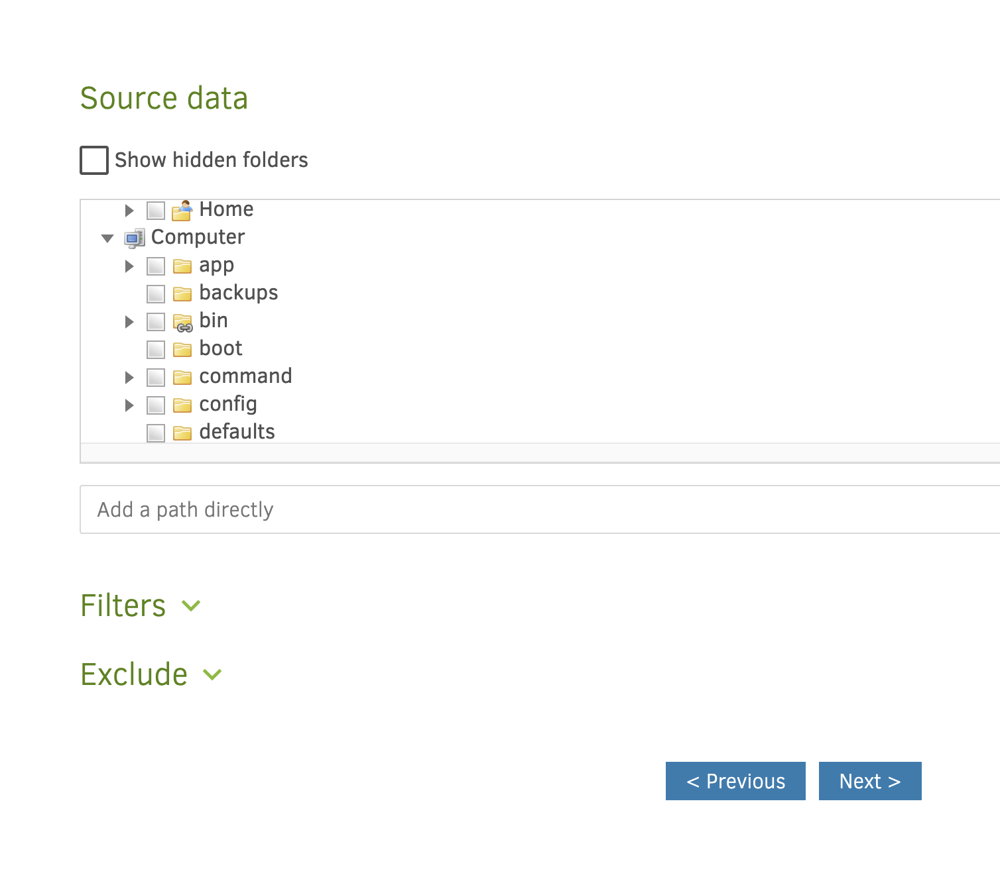
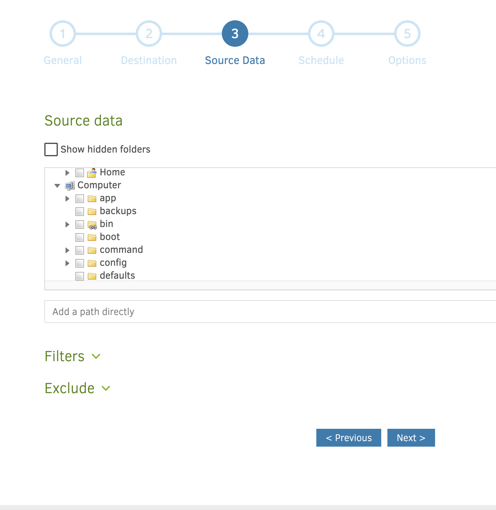
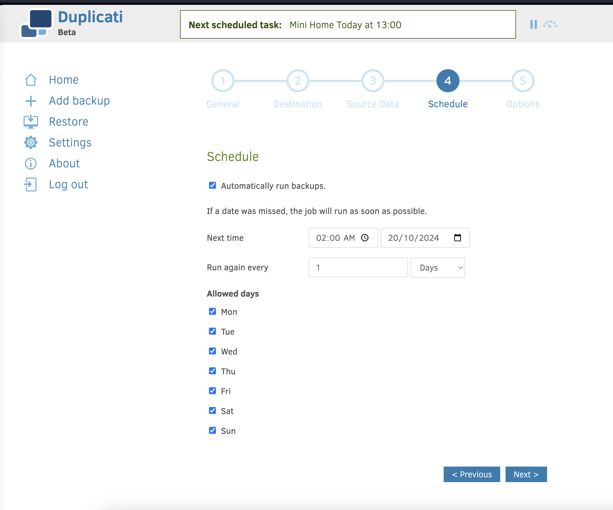
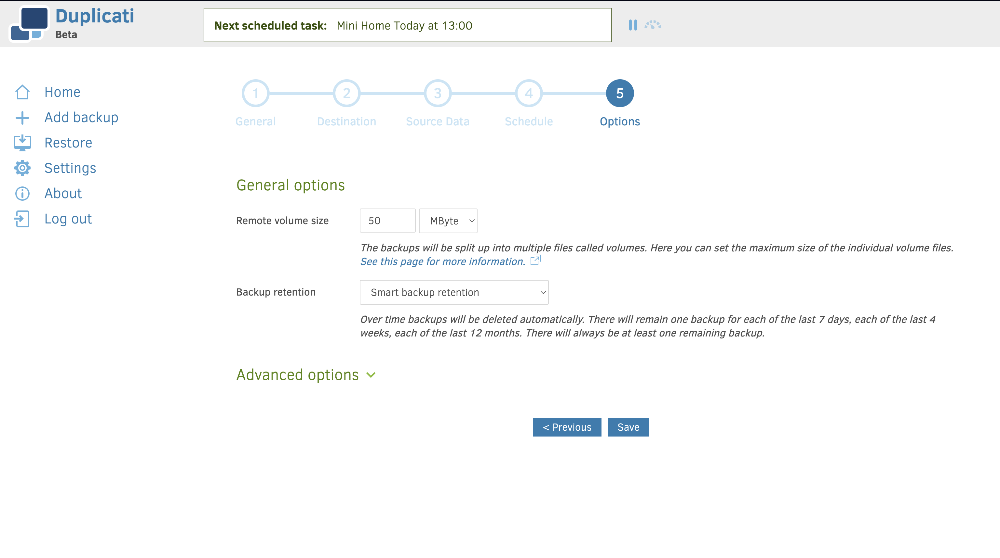
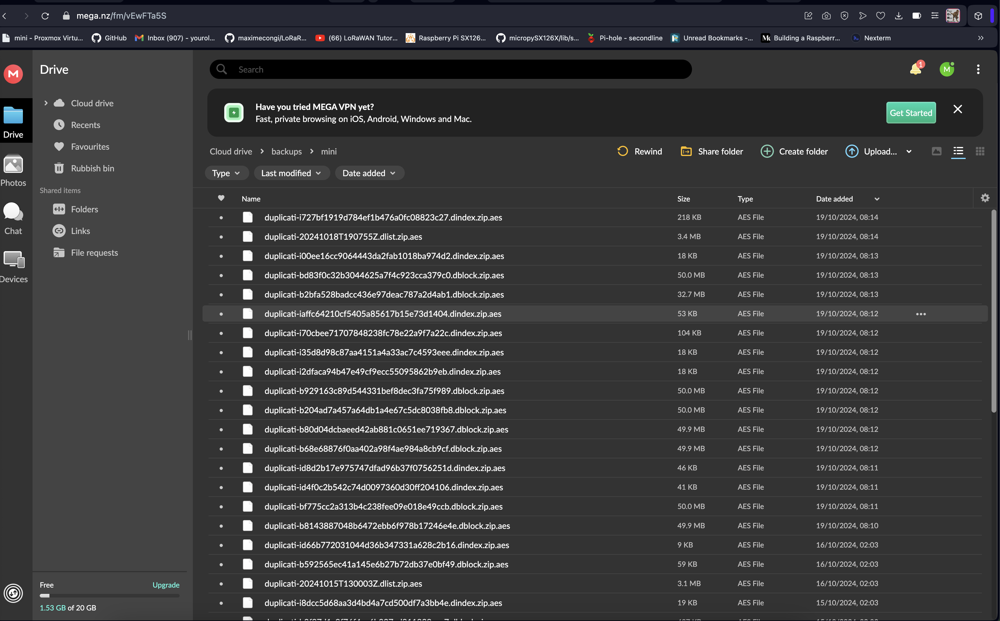

# DOX - A Computer Scientists NoteBook

## Monitoring tools (Prometheus, Grafana, Datadog, New Relic)


For full source visit [github](https://github.com/youroldmangaming/Grafana-Telegraf-Prometheus-Promtail.git).












### Importance of Monitoring in DevOps

In DevOps, **monitoring** plays a critical role as it provides visibility into the health, performance, and availability of applications and infrastructure. It allows teams to track key performance indicators (KPIs), identify issues early, and ensure that systems are meeting the desired service level agreements (SLAs). Here’s why monitoring is vital in a DevOps environment:

```c
version: "2.1"
services:
  duplicati:
    image: lscr.io/linuxserver/duplicati:latest
    container_name: duplicati
    environment:
      - PUID=0
      - PGID=0
      - TZ=Pacific/Auckland
      - CLI_ARGS= #optional
    volumes:
      - ./config:/config
      - ./backups:/backups
      - /:/source
    ports:
      - 8200:8200
    restart: unless-stopped
```


1. **Early Detection of Issues**: Monitoring tools provide real-time insights into infrastructure and application health, enabling quick identification and resolution of issues before they impact end-users. This reduces downtime and ensures high availability.
   
2. **Performance Optimization**: By tracking metrics like CPU usage, memory, disk I/O, and network traffic, teams can detect bottlenecks and optimize resource utilization to ensure systems run efficiently.

3. **Automation and Incident Response**: Monitoring helps automate responses to incidents such as system overloads or resource exhaustion. This enables teams to implement self-healing systems that automatically resolve certain issues without manual intervention.

4. **Continuous Improvement**: Data from monitoring is used in post-mortems and retrospectives to analyze incidents, learn from failures, and continuously improve infrastructure and applications.

5. **Compliance and Reporting**: Monitoring provides logs and metrics essential for compliance, auditing, and reporting to ensure that systems meet regulatory requirements and internal policies.

### Monitoring in a Cluster

In a **clustered environment**, monitoring becomes even more important due to the distributed nature of the infrastructure. A cluster consists of multiple nodes that may fail independently or exhibit performance variations. Monitoring clusters help in:

- **Node Health**: Monitoring ensures each node in the cluster is operating correctly and efficiently, helping to identify when a node is underperforming or has failed.
  
- **Resource Distribution**: Clusters often balance workloads across multiple nodes. Monitoring ensures even distribution and can detect imbalances or resource saturation on specific nodes.
  
- **Scaling Decisions**: Cluster monitoring helps determine when to scale resources up or down based on load, traffic, or application demand.
  
- **Failure Recovery**: Clusters need to automatically recover from failures. Monitoring aids in detecting failures and ensuring that the failover or recovery processes work as expected.
  
- **Performance Tuning**: Monitoring assists in understanding how workloads are distributed, enabling performance tuning to ensure optimal usage of the cluster.

### Monitoring Tools: Grafana, Prometheus, and Telegraf
For full source visit [github](https://github.com/youroldmangaming/Grafana-Telegraf-Prometheus-Promtail.git).


- **Grafana**: Grafana is an open-source analytics and interactive visualization tool. It is often used in conjunction with Prometheus for monitoring time-series data. It provides a flexible dashboard and alerting system that helps DevOps teams visualize metrics across clusters and applications. Grafana is popular due to its ability to integrate with various data sources and create dynamic, customizable dashboards.

- **Prometheus**: Prometheus is an open-source monitoring and alerting toolkit designed specifically for reliability. It focuses on collecting time-series data and generating real-time alerts based on that data. Prometheus is excellent for cluster monitoring, as it can track the state of various nodes and services, trigger alerts when things go wrong, and integrate seamlessly with Grafana for visualization.

- **Telegraf**: Telegraf is an agent for collecting metrics from systems, sensors, databases, and other data sources. In a cluster, Telegraf can be deployed on each node to collect detailed metrics such as CPU, memory, disk usage, and network activity. These metrics can then be sent to Prometheus or a time-series database like InfluxDB for analysis and visualization in Grafana.

### Workflow in a Clustered Monitoring Setup

1. **Data Collection**: Telegraf agents collect metrics from various sources across the cluster, including node performance, application health, and infrastructure usage.
   
2. **Storage and Alerting**: Prometheus scrapes the data from Telegraf or directly from services and stores it as time-series data. It also evaluates pre-configured rules to generate alerts if thresholds are breached (e.g., high CPU or memory usage).
   
3. **Visualization**: Grafana uses Prometheus as a data source to generate visual dashboards, offering insights into the performance of the cluster, individual nodes, and applications.

### Conclusion

Monitoring is essential for ensuring the reliability, performance, and scalability of DevOps environments. In clusters, it provides a way to maintain visibility across multiple nodes, ensuring that they work together seamlessly. Grafana, Prometheus, and Telegraf are key tools in this ecosystem, providing powerful metrics collection, alerting, and visualization capabilities to help manage and optimize complex, distributed systems.


<div style="font-size: 50%;">
  <pre><code>
  ┌────────────────────────────────────────────────────────────────────────┐   
  │                                                                        │   
  │ @@@@@@@@@@@@@@@@@@@@          %@@@@@@@@%          %@@            %@@   │   
  │ @@@@@@@@@@@@@@@@@@@@       %@@@@@@@@@@@@@@%     %@@@@@@        *@@@@@@ │   
  │ @@@@@@@@@@@@@@@@@@@@      @@@@@@@@@@@@@@@@@@     @@@@@@@%     @@@@@@%  │   
  │ @@@@@          %@@@@     %@@@@@%       @@@@@@      @@@@@@@% @@@@@@%#   │   
  │ @@@@@          %@@@@    %@@@@@          @@@@@@       @@@@@@@@@@@@#     │   
  │ @@@@@          %@@@@    @@@@@@          #@@@@@         @@@@@@@@%       │   
  │ @@@@@          %@@@@    @@@@@@          %@@@@@        %@@@@@@@@@       │   
  │ @@@@@          %@@@@    *@@@@@*         @@@@@%      #@@@@@@@@@@@@@     │   
  │ @@@@@@@@@@@@@@@@@@@@     @@@@@@@%     @@@@@@@     #@@@@@@@  @@@@@@@@   │   
  │ @@@@@@@@@@@@@@@@@@@@      *@@@@@@@@@@@@@@@@%    *@@@@@@@      @@@@@@@% │   
  │ @@@@@@@@@@@@@@@@@@@@        %@@@@@@@@@@@@@       @@@@@%         @@@@@% │   
  │                                %@@@@@@%            @%             @%   │   
  │                                                                        │   
  └────────────────────────────────────────────────────────────────────────┘
                                           A Computer Scientist's Notebook
                                                            Y0MG 1990-2024
GitHub Repository https://github.com/youroldmangaming/DOX
Documentation Site https://dox.youroldmangaming.com
  </code></pre>
</div>


