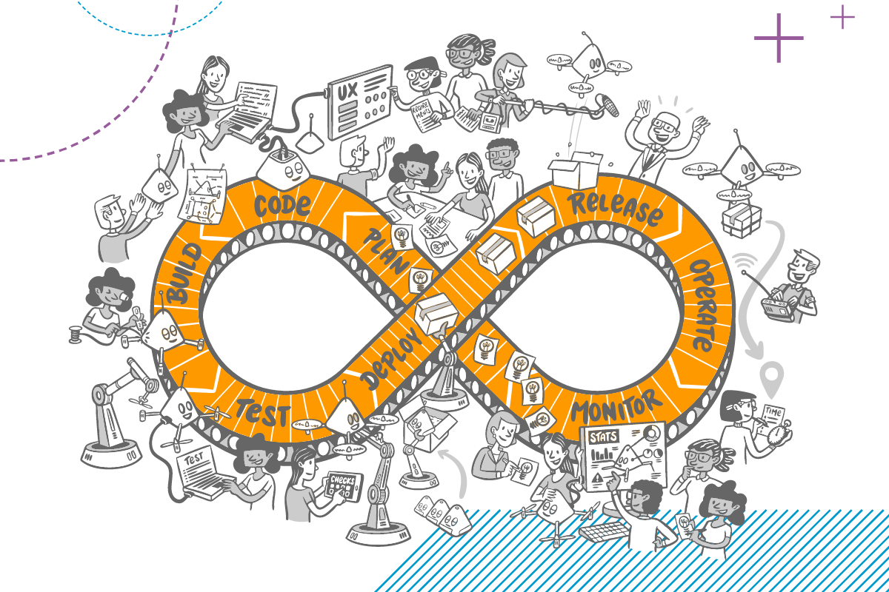

# DevOps Mindset & Philosophy

<audio controls>
  <source src="../feedback.mp3" type="audio/mpeg">
  Your browser does not support the audio element.
</audio>

Positive and negative feedback loops are indeed one of the most powerful concepts ever developed, with their influence stretching across a vast range of disciplines. From self-assessment and personal growth to complex systems like electronics, project management, and AI learning systems, feedback loops are fundamental to how we understand, improve, and control processes.

In self-assessment, feedback loops help individuals reflect on their actions, adjust behaviors, and achieve personal goals. Positive feedback reinforces actions that lead to success, while negative feedback helps identify areas for improvement. Similarly, in electronics, feedback loops control system stability and performance, ensuring circuits function properly by adjusting signals in response to output changes.

In project delivery, feedback loops allow teams to make course corrections during a project’s lifecycle. Continuous evaluation and adjustment—whether it's refining strategies or addressing challenges—lead to better outcomes. And in AI systems, feedback loops drive learning and improvement. AI models adjust based on feedback from their environment, learning from errors and refining their outputs, mimicking human learning.

This universal applicability, across so many fields, showcases just how pervasive and powerful the feedback loop concept is in shaping progress and innovation. It allows us to refine everything from personal development to cutting-edge technology.

---
**DOX - A Computer Scientist's Notebook**  
_Y0MG 1990-2024_  
[GitHub Repository](https://github.com/youroldmangaming/DOX/tree/master) | [Documentation Site](https://dox.youroldmangaming.com)

---
