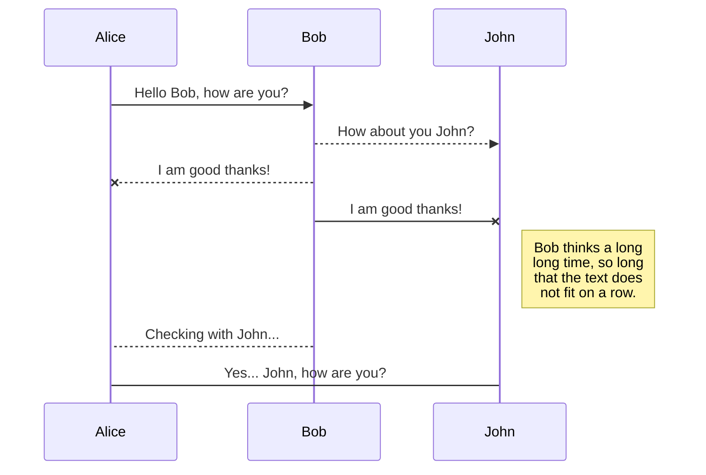
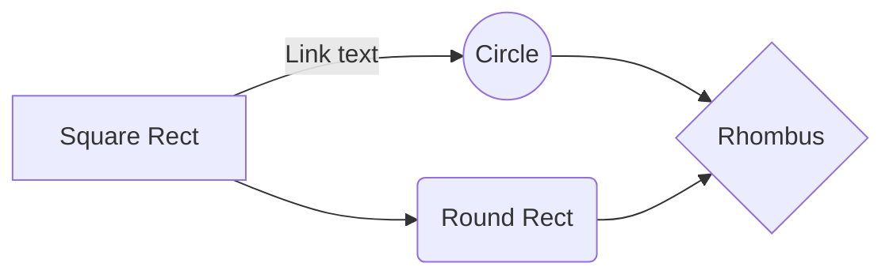

# DOX - A Computer Scientists Lab NoteBook


For full source visit [github](https://github.com/youroldmangaming/DOX/).

# Notebook Overview

**Welcome to DOX. A Computer Scientists Lab NoteBook.

With DOX I will be documenting the setups of various technical labs, hardware experiments, software configurations, as well as intresting tests performed. This site will serve as a reference for future experiments as well as a learning tool for others.

Here is my gift to you. A lifetime of software development and experience in all roles within IT and T, from greenfield self-starting software houses to fully enabled small to medium-sized teams, and then onto enterprise-level standards-based production. From being a Junior  Software Engineer to becoming a Chief Technical Officer across multiple companies. The scope of DOX includes:

Software Engineering,
Infrastructure Implementation,
Database design, Security, and System Administration, 
Service Delivery and Account Management as well as 
Product Development and Marketing,
mixed with ITIL, PMP, Prince2 and industry Best Practices and the scares of many many 
Projects and Programmes delivered across the world.

This endeavor will cover it all, with no simple demarcation, as these fields are all deeply intertwined as has been my career.

In saying that, this journey started all thanks to Mr. Dale, way back in 1979 when I was a boy. Mr Dale brought his Apple 2 into the Parents School Day, showing how to change the color of a sprite via code. It was at this very instance in time, it was determined that I would set out to become a Computer Scientist, I had not choice. What you will find within DOX is a life time of experience along with interesting projects and experiments, mixed with best practice. Have fun and enjoy the journey along with me.

<iframe width="560" height="315" src="https://www.youtube.com/embed/_mOaCiMCN2Y" frameborder="0" allow="accelerometer; autoplay; clipboard-write; encrypted-media; gyroscope; picture-in-picture" allowfullscreen></iframe>

## Core Documentation Features

### 1. Project and Experiment Logging
- Document detailed step-by-step instructions on setting up labs, configurations, experiments, and troubleshooting.

### 2. Categorization and Tagging
- Organize logs by categories (e.g., hardware setups, software configurations, Docker experiments) and tags (e.g., Raspberry Pi, LoRa, Docker, Ansible, IoT).

### 3. Version Control for Documentation
- Store all experiment logs in a version-controlled repository (e.g., Git), allowing for proper revision history.

### 4. Searchable Knowledge Base
- Implement search functionality to easily find past experiments and configurations.

### 5. Interactive Code/Command Blocks
- Provide code snippets and commands in the documentation with options to easily copy them.

### 6. Collaborative Notes and Comments
- Allow for collaborative notes where others can comment on existing entries or contribute new insights.


Interactive Code/Command Blocks:

Provide code snippets and commands in the documentation with options to copy them easily.

Collaborative Notes and Comments:
Option to add collaborative notes for others, allowing them to comment on existing entries or contribute new insights.

## Commands

* `mkdocs new [dir-name]` - Create a new project.
* `mkdocs serve` - Start the live-reloading docs server.
* `mkdocs build` - Build the documentation site.
* `mkdocs -h` - Print help message and exit.
* This is a test3.
## Project layout

    mkdocs.yml    # The configuration file.
    docs/
        index.md  # The documentation homepage.
        ...       # Other markdown pages, images and other files.


## SmartyPants

SmartyPants converts ASCII punctuation characters into "smart" typographic punctuation HTML entities, this will be used extensively in this notebooks documentation.

For example:

|                |ASCII                          |HTML                         |
|----------------|-------------------------------|-----------------------------|
|Single backticks|`'Isn't this fun?'`            |'Isn't this fun?'            |
|Quotes          |`"Isn't this fun?"`            |"Isn't this fun?"            |
|Dashes          |`-- is en-dash, --- is em-dash`|-- is en-dash, --- is em-dash|


## KaTeX

LaTex is a great documentation engine. I will be using KaTex to render mathematical expressions [KaTeX](https://khan.github.io/KaTeX/):

The *Gamma function* satisfying $\Gamma(n) = (n-1)!\quad\forall n\in\mathbb N$ is via the Euler integral

$$
\Gamma(z) = \int_0^\infty t^{z-1}e^{-t}dt\,.
$$

> You can find more information about **LaTeX** mathematical expressions [here](http://meta.math.stackexchange.com/questions/5020/mathjax-basic-tutorial-and-quick-reference).


## UML diagrams

I will be using UML diagrams within the documentation via [Mermaid](https://mermaidjs.github.io/). For example, this will produce a sequence diagram:



And this will produce a flow chart:



# Code Block Example
I will be producing code and scripts for various setups and examples. I will be using some snippets in code blocks as follows, but in most case will have github repositories setup with working solutions.

## JavaScript Code Block

```javascript
function greet(name) {
    console.log("Hello, " + name + "!");
}

greet("World");
```

"I'm very highly educated. I know words, I have the best words." DJT 2015


---
**DOX - A Computer Scientist's Notebook**  
_Y0MG 1990-2024_  
[GitHub Repository](https://github.com/youroldmangaming/DOX/tree/master) | [Documentation Site](https://dox.youroldmangaming.com)

---
