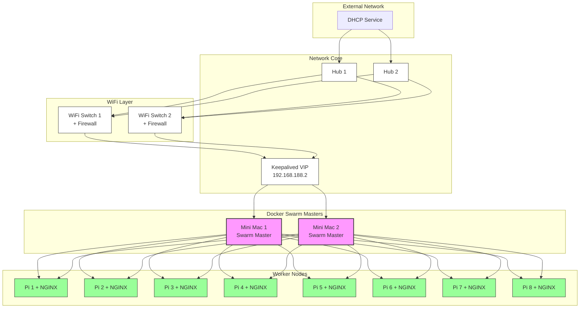

# DOX - A Computer Scientists NoteBook


For full source visit [github](https://github.com/youroldmangaming/DOX/).


<audio controls>
  <source src="../pi0.mp3" type="audio/mpeg">
  Your browser does not support the audio element.
</audio>


# Building a Cluster using Raspberry Pi's

# Building a Miniature Home Lab Cluster with Raspberry Pi 5 and Open Source HPC Software

This guide documents the process of building a miniature, open-source cluster using Raspberry Pi computers and high-performance computing (HPC)-grade software. The focus is on creating a low-cost home lab environment that is scalable and adaptable to various setups.

When I first started this project, I found that detailed guides were surprisingly sparse, especially for setting up modern Pi clusters with HPC tools. As I document my progress, I hope to provide a series of guides for others embarking on similar projects. This first guide covers the basics: **setting up the hardware** and **getting a cluster scheduler running**.

---

## Step 0: Get The Hardware

Here’s the parts list for my cluster:

### Compute Nodes:
- **6x Raspberry Pi 5 (8GB)** — These will act as the primary compute nodes, handling most of the heavy lifting during task execution. They are relatively cheap and small and powerful, so as you need to scale, from a home labbers perspective, keeping these parameters under control is crucial.

### Master Node:
- **1x Mac Mini (2013)** — This will be used as the master or login node, handling job submission, scheduling, and management. Initially I thought that this would be too out of date. But after I installed linux(Proxmox on bear metal), it performed very well.

### Additional Infrastructure:
- **1x Raspberry Pi 4 (8GB)** —
- This will serve as an auxiliary node, for additional services or as a backup node. It can also assist with tasks like file serving, monitoring, or handling external access.


### Networking:
- **4x 4-port Wifi Network Switches** — These switches will connect all devices, allowing fast communication between nodes. They are meshed together over wifi and allocate static IPs. This will allow for flexibility in transporting the solution around the lab but also allow you to isolate the solution, as required, from the home network as you can saturate your daughters online game streaming business, so save yourself a headache.  


### Power Supply:
- **Power Cables and USB Power Supply** — Powering all the Raspberry Pi devices. Depending on your setup, a multi-port USB power supply will help minimize cable clutter.

Turning the cluster on and off via a single button can be conducted in one of two way, with wiring and a firmware level interaction via the onboard functionality. The second option is to write a program to detect the state on one device going into shutdown and cascading this across the custer. Having going down this second path with marginal positive outcomes the physical route has been determined to be the path of least resistence to get to the desirded outcome.

# RPI-Cluster Turn Off and Turn On

The cluster is to be turned on an off using a single push button.

The button has two wires +ve and -ve that get terminated in parallel to each of the 8 raspberry Pi's in the cluser to GPIO 5 and 6.

An update to the `sudo nano /boot/firmware/config.txt  ` add the below:

```
dtoverlay=gpio-shutdown
```
When the cluster is in an on state pressing and holding the button for 3 seconds will turn off all Rapberry Pis in the cluster.

This will put the Raspberry Pi's into a hybernated mode.

Once in this mode turning the cluster back on is again, just holding down the button.


# Synchronising time across a cluster is crucial for several reasons:

Setup GPS for Stratum 2 Time Accuracy  [github](https://github.com/youroldmangaming/ClusterTimeAdjustment.git).


1. **Data Consistency**: In distributed systems, many operations depend on timestamps to ensure consistency. For example, databases often use timestamps to order transactions and maintain the integrity of the data. If different nodes have mismatched times, it can lead to conflicts and data corruption  .

2. **Log Coordination**: In a cluster, each node generates logs that are used for monitoring, debugging, and auditing. If the timestamps in these logs are not synchronized, it becomes challenging to correlate events across different nodes. This can complicate troubleshooting and performance monitoring  .

3. **Coordination of Distributed Processes**: Many distributed algorithms, such as leader election and consensus protocols, rely on synchronised clocks. For instance, in protocols like Paxos and Raft, having a common notion of time helps nodes make consistent decisions  .

4. **Network Protocols**: Many network protocols, including those for authentication and secure communications (like Kerberos), depend on synchronised time to prevent replay attacks and ensure valid session states. A significant time difference can lead to failed authentications and security vulnerabilities .

5. **Performance Optimisation**: Some applications, particularly in cloud computing and microservices, rely on precise timing for tasks like load balancing and resource allocation. Synchronized clocks enable efficient scaling and resource management across a cluster  .

6. **Compliance and Auditing**: In many industries, regulatory compliance requires accurate timekeeping for data transactions and security logs. Failure to synchronize time can result in non-compliance and potential legal issues  .

In summary, time synchronisation is a foundational requirement for the reliable operation of distributed systems, impacting data integrity, system performance, security, and compliance.

### Sources
- [Distributed Systems: Principles and Paradigms](https://www.amazon.com/Distributed-Systems-Principles-Paradigms-2nd/dp/0132392279)
- [Time Synchronization in Distributed Systems](https://www.cs.cornell.edu/home/benja/6110/notes/time_sync.html)
- [The Importance of Time Synchronization in Networking](https://www.networkworld.com/article/3246615/the-importance-of-time-synchronization-in-networking.html)


# High Availibility:

**High Availability (HA)** refers to a system's ability to operate continuously without failure for a long period. This is crucial for critical systems, where downtime can result in significant business, operational, or financial losses. High availability is typically achieved by reducing or eliminating single points of failure (SPOF) and implementing failover mechanisms that allow seamless continuation of service even if a component fails.

In a cluster, **High Availability** ensures that if one node or service goes down, another can take over with minimal or no downtime. Clusters are used to distribute workloads and provide redundancy, increasing both performance and fault tolerance.

### How **Keepalived** Supports High Availability in a Cluster: [github](https://github.com/youroldmangaming/Cluster-HA/blob/main/keepalived.md)

1. **VRRP (Virtual Router Redundancy Protocol)**:
   Keepalived primarily uses VRRP to create a **virtual IP address** that can be shared between multiple nodes in a cluster. The node configured as the **master** node holds the virtual IP and processes requests. If the master node fails, the **backup** node, with a lower priority, detects the failure and assumes control of the virtual IP, ensuring continuous service availability.
   
   The use of VRRP for HA means that clients or external systems don’t need to be aware of the failover; they interact with the same virtual IP, regardless of which node is handling the requests.

2. **Failover Mechanism**:
   Keepalived continuously monitors the state of the master node. If the master node fails due to hardware or software issues (e.g., network failure, crash), the backup node quickly takes over the virtual IP address, minimizing downtime and ensuring the application or service is still available.

3. **Load Balancing**:
   While Keepalived’s primary function is to maintain high availability through VRRP, it can also balance traffic loads across multiple servers or services. This feature ensures that requests are distributed evenly among nodes, which can help prevent overloading a single node and ensure higher availability of resources.

4. **Health Checking**:
   Keepalived can perform health checks on critical services, such as web servers, databases, or network connections. If it detects that a service on the master node is not functioning correctly, it can initiate a failover to the backup node. This ensures that only healthy nodes serve requests, improving overall reliability.

5. **Failback**:
   Keepalived supports automatic **failback**, meaning that when the master node recovers, it can automatically reclaim the virtual IP from the backup node and resume its role as the primary service provider. This helps maintain the original hierarchy and ensures optimal performance.

### Example Scenario:

Imagine a web application running on a cluster of two nodes. Without HA, if the server hosting the application crashes, users experience downtime until the server is fixed. However, with Keepalived:

- Node 1 is configured as the master, and Node 2 as the backup.
- The application is accessible via a shared virtual IP (e.g., `192.168.188.2`).
- If Node 1 fails, Keepalived detects this and assigns the virtual IP to Node 2.
- Users continue to access the application without noticing the switch.

This setup ensures continuous service even in the event of a node failure.

In summary, **Keepalived** plays a crucial role in achieving high availability in clusters by offering redundancy, failover mechanisms, and load balancing, ensuring minimal disruption and continuous operation in case of failures.


The high-availability home lab setup. The architecture shows a well-thought-out approach to building a resilient, scalable system.

Key components:
1. 8 Raspberry Pi worker nodes (labeled 1-8) in a Docker Swarm configuration
2. Dual network paths through Hub 1 and Hub 2 for redundancy
3. WiFi Switch layer with integrated firewalls
4. DHCP service at the top of the architecture
5. Keepalived managing a floating IP (192.168.188.2) for high availability

The design incorporates several excellent high-availability features:
- Hardware redundancy through dual hubs and WiFi switches
- Service redundancy through Keepalived
- Workload resilience through Docker Swarm
- Load balancing across the worker nodes based on current capacity
- NGINX servers providing distributed web services





---
**DOX - A Computer Scientist's Notebook**  
_Y0MG 1990-2024_  
[GitHub Repository](https://github.com/youroldmangaming/DOX/tree/master) | [Documentation Site](https://dox.youroldmangaming.com)

---
